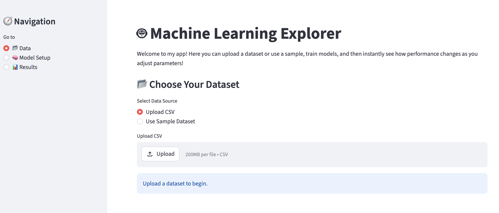
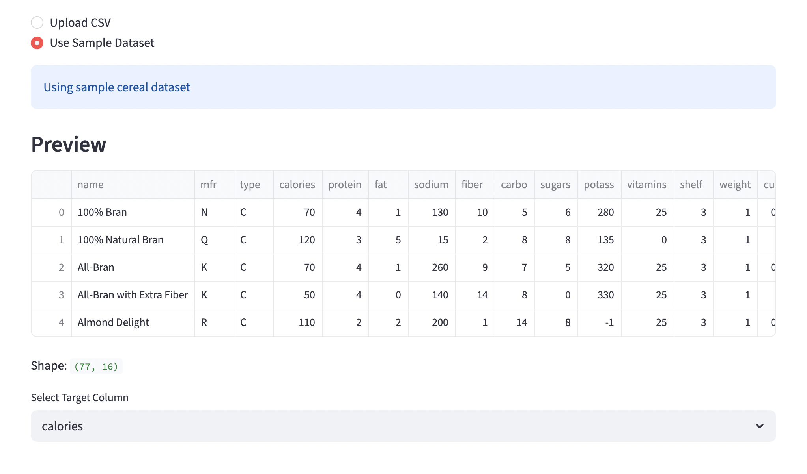
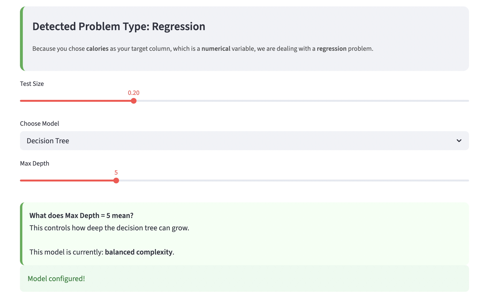
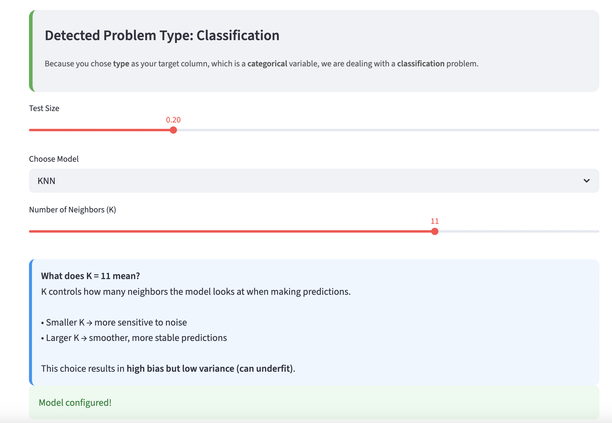
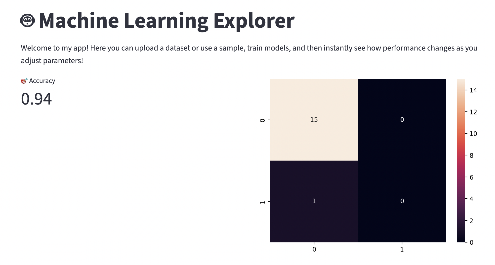
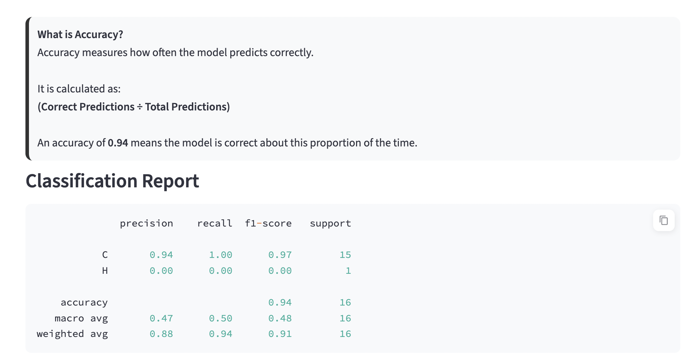
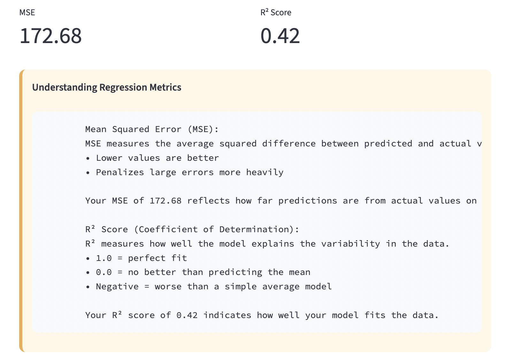
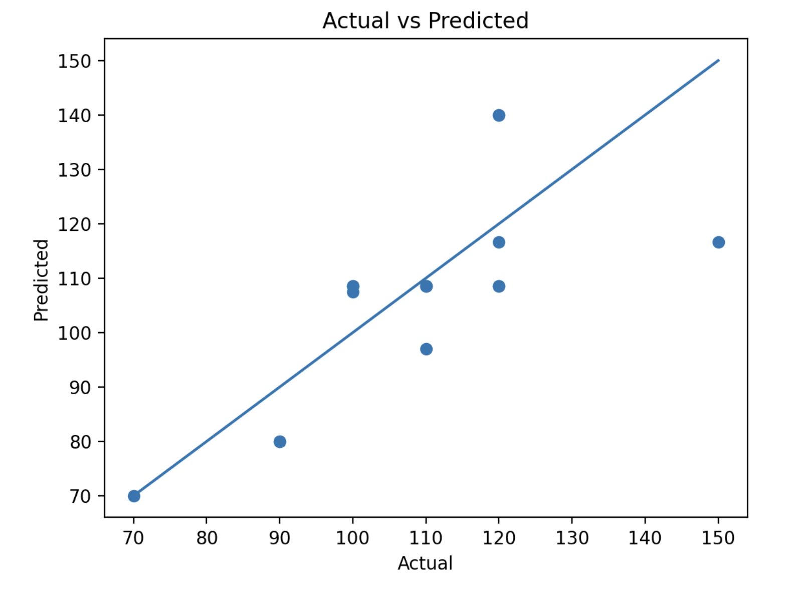

# **Welcome to my Supervised Learning Streamlit App!**
The goal of my project was to develop a streamlit app that guides the users through a supervised machine learning experience.
On the app, users can navigate across 3 different tabs, where they can explore different aspects of the machine learning process!

#**Tab 1 - Data 📂**

Users can upload their own dataset or choose a sample dataset. Once they see a preview of the dataset, they can select a target column.

#**Tab 2 - Model Setup 🧠**

Users can choose between 2 machine learning models that work for both classification and regression tasks.
  1. Decision Tree - a model that creates a hierarchical structure of "branches" that guides the computer towards a decision.
     The user uses a slider to adjust the Max Depth of the tree formed by this model.
  2. K-Nearest Neighbors (KNN) - a distance-based model that predicts using nearby data points.
     The user uses the slider to adjust the K, or number of neighbors, that the model uses to predict.
The user can then set their own hyperparameters, such as test size, max depth (if they choose Decision Tree) and K (if they choose K-Nearest Neighbors).

#**Tab 3 - Results 📊**

Users can now see how the hyperparameters that they chose affected model performance!
If they chose a classification problem, users see the accuracy of their model, a confusion matrix, and a classification report.
If they chose a regression problem, users see MSE and R^2 scores, and a plot of predictions vs. actual values with a reference line.

Click here to visit my app: *deployed link*

To run this app locally:
  1. Clone the respository:
     git clone https://github.com/annabohlen/Bohlen-Data-Science-Portfolio/MLStreamlitApp.git
     cd MLStreamlitApp
  2. Download the necessary libraries and versions:
    streamlit==1.36.0,
    pandas==2.2.2,
    numpy==1.26.4,
    scikit-learn==1.5.1,
    matplotlib==3.9.0,
    seaborn==0.13.2
   3. Run the streamlit app
      (streamlit run code.py) 

Here are some of the resources I used to build this app:
  Sample dataset: https://www.kaggle.com/datasets/crawford/80-cereals
  Streamlit cheat sheet: https://docs.streamlit.io/develop/quick-reference/cheat-sheet
  Markdown guide: https://www.markdownguide.org/basic-syntax/
