# **Welcome to my Unsupervised Learning Streamlit App!**
The goal of my [project](https://bohlen-data-science-portfolio-6hbbsn7aojhhmkqwje5mwy.streamlit.app/) was to develop a streamlit app that guides the users through an unsupervised machine learning experience.
On the app, users can navigate across 3 different tabs, where they can explore different aspects of the unsupervised machine learning process!

**Tab 1 - Data 📂**

Users can upload their own dataset or choose a sample dataset.

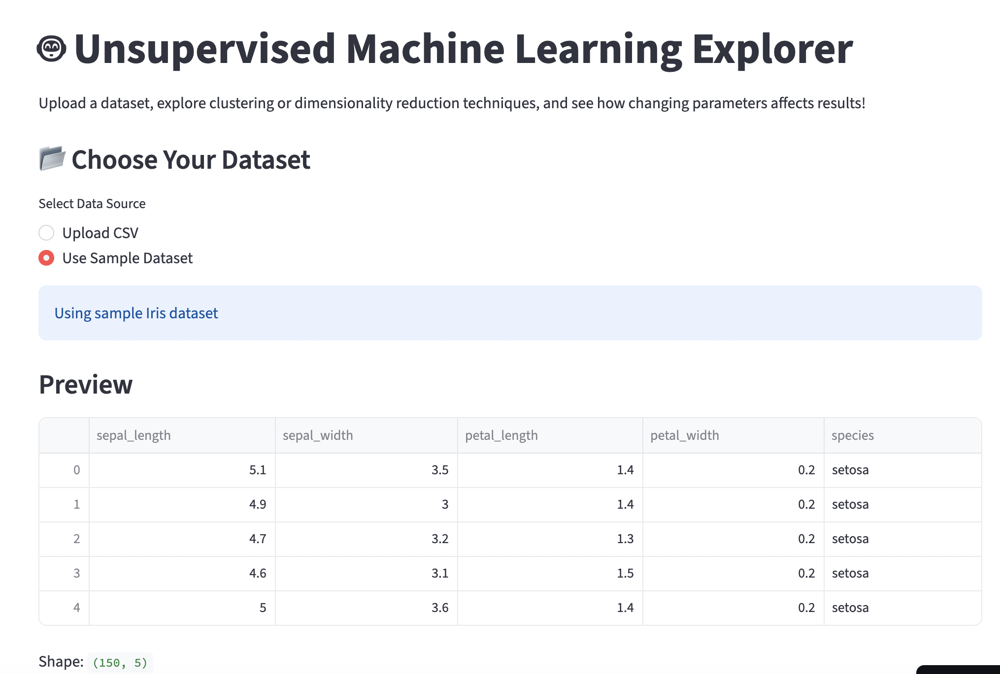

**Tab 2 - Model Setup 🧠**

Users choose between 3 unsupervised machine learning models, and set their own hyperparameters accordingly:
  1. K-Means Clustering - a clustering model that assigns each data point to the nearest cluster center and repeatedly adjusts the centers until the clusters stabilize.
     The user uses a slider to adjust the k, or the number of clusters the algorithm will form.
  2. Hierarchical Clustering - a clustering model that groups similar data points together based on their features.
     The user uses the slider to adjust the linkage method that the model uses.
  3. Principal Component Analysis - a dimensionality reduction technique that transforms the original variables into a smaller set of new variables called principal components.

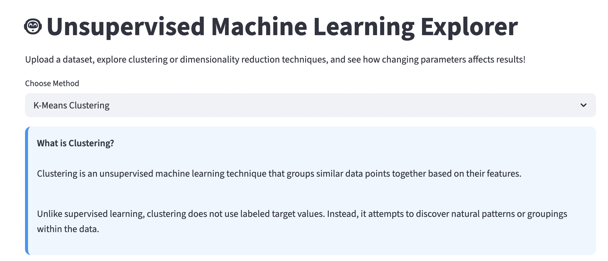
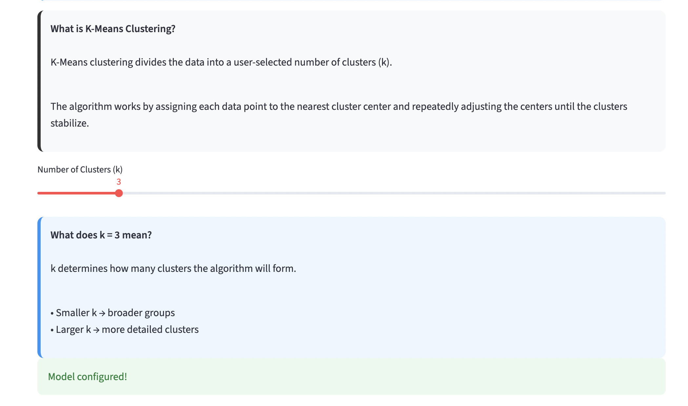
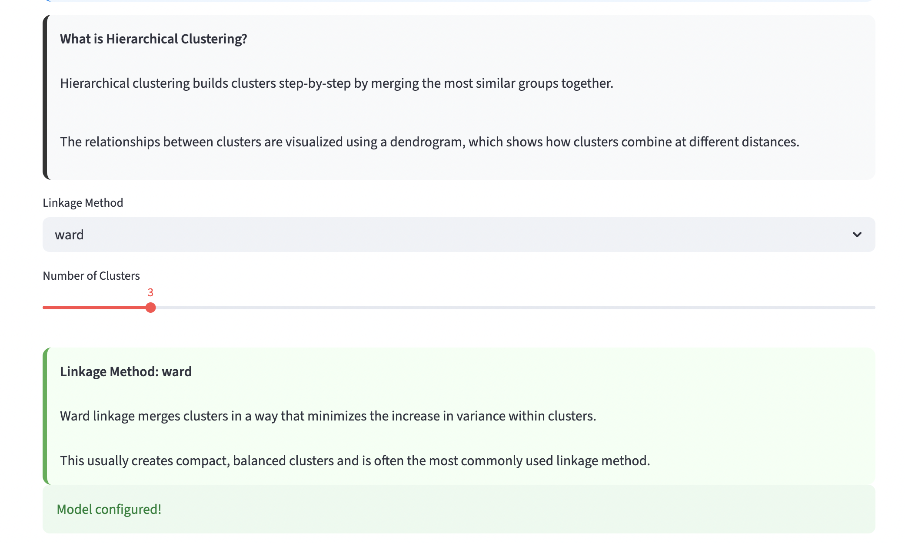
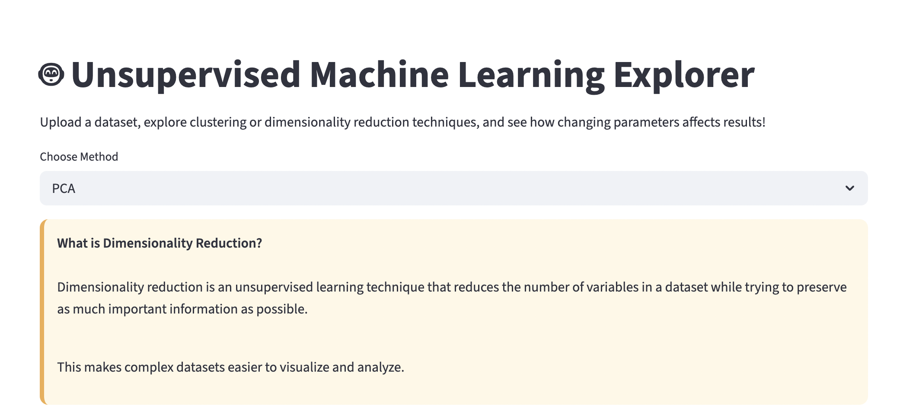
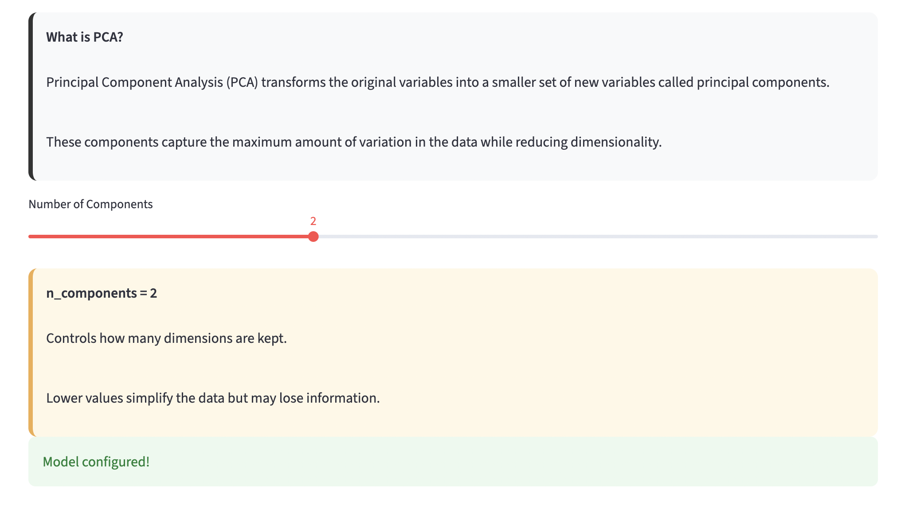

**Tab 3 - Results 📊**

Users can now see how the hyperparameters that they chose affected model performance!
If they chose K-Means Clustering, users see a silhouette score, a cluster visualization, and and elbow plot.
If they chose Hierarchical Clustering, users see a dendrogram and a cluster visualization.
If they chose PCA, users see the proportion of variance explained, a PCA scatterplot, and a Cumulative Explained Variance Plot.

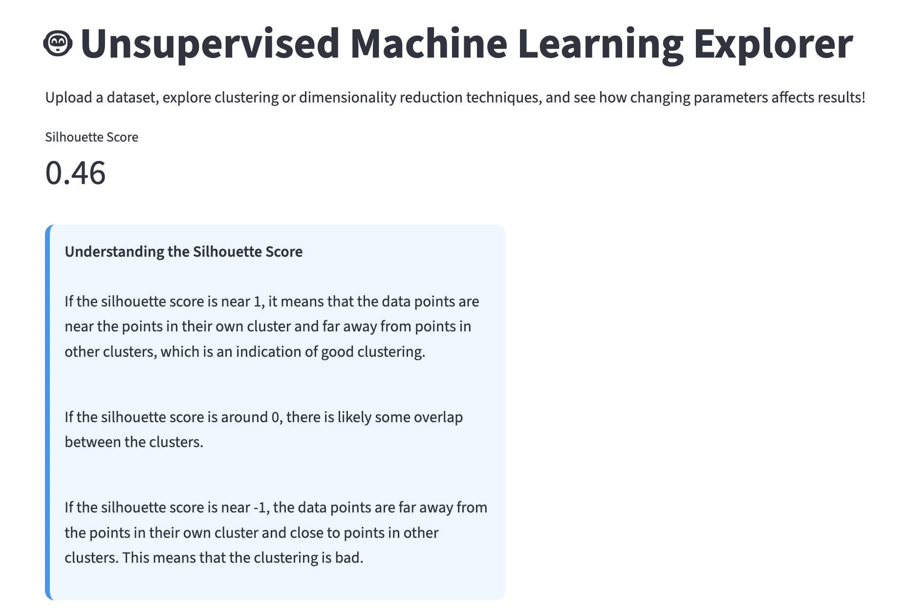
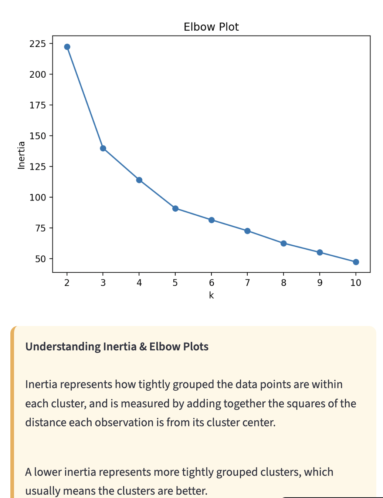
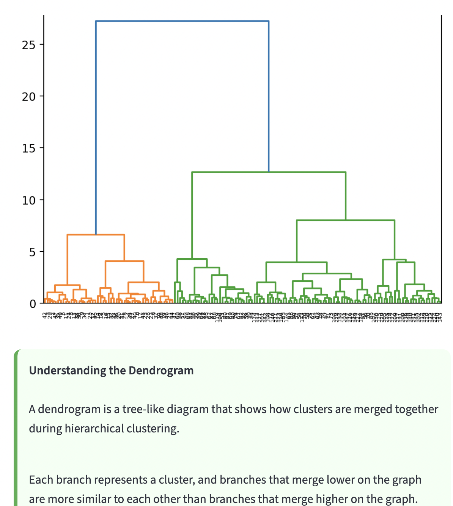
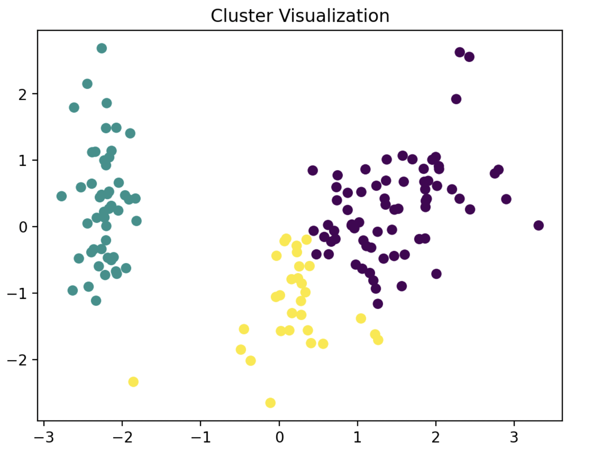

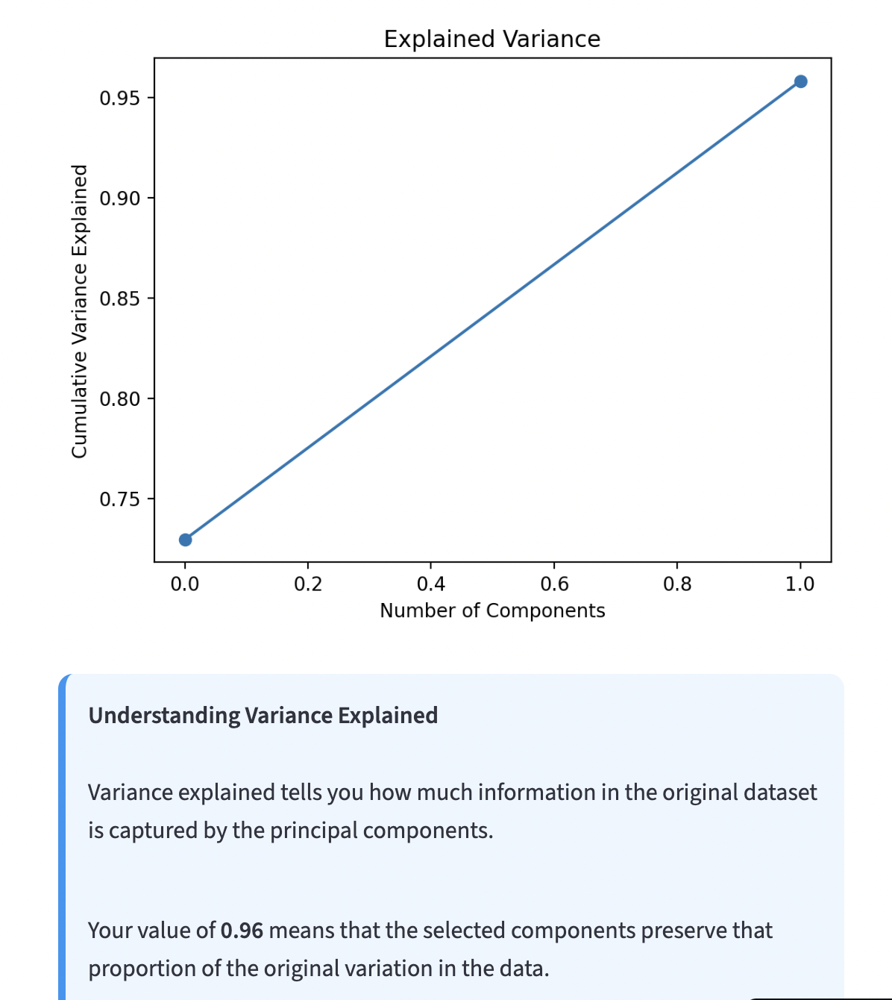

Click here to visit my app: https://bohlen-data-science-portfolio-6hbbsn7aojhhmkqwje5mwy.streamlit.app/

To run this app locally:
  1. Clone the respository:
     git clone https://github.com/annabohlen/Bohlen-Data-Science-Portfolio/MLUnsupervisedApp.git
     cd MLUnsupervisedApp
  2. Download the necessary libraries and versions:
    streamlit==1.37.0,
    pandas==2.2.2,
    numpy==2.0.1,
    scikit-learn==1.5.1,
    matplotlib==3.9.2,
    seaborn==0.13.2,
    scipy==1.14.1
   3. Run the streamlit app
      (streamlit run app.py) 

Here are some of the resources I used to build this app: 
  Streamlit cheat sheet: https://docs.streamlit.io/develop/quick-reference/cheat-sheet 
  Markdown guide: https://www.markdownguide.org/basic-syntax/
