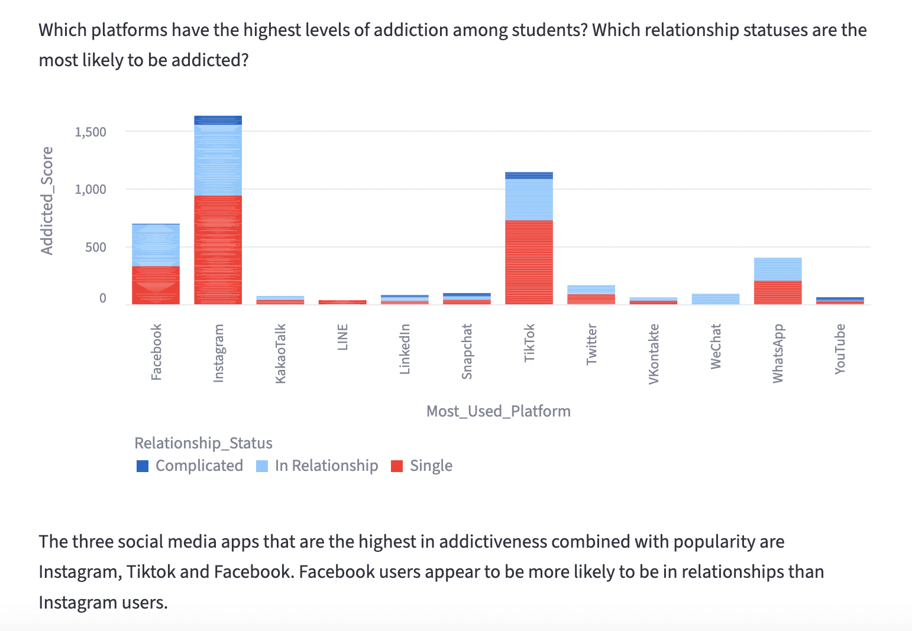
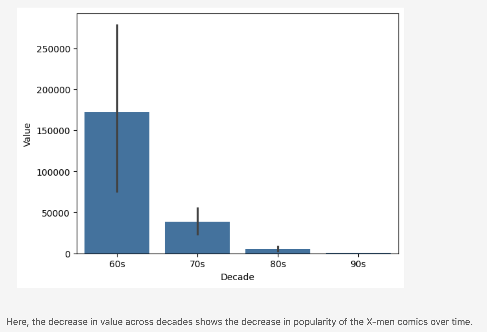
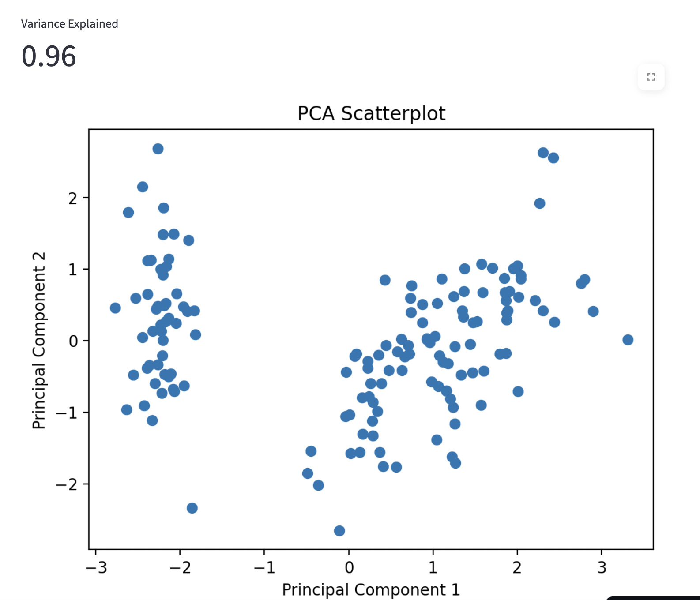

# **Welcome to my Introduction to Data Science course repository!**
This is where I will keep all the projects I work on in my Introduction to Data Science course. 
At a glance: 
Project #1 - [Streamlit App Analysis of Dataset on Student Social Media](https://github.com/annabohlen/Bohlen-Data-Science-Portfolio/tree/main/basic_streamlit_app)
Project #2 - [Jupyter Notebook EDA of Mutant Moneyball Dataset](https://github.com/annabohlen/Bohlen-Data-Science-Portfolio/tree/main/TidyData-Project)
Project #3 - [Interactive Supervised Machine Learning Streamlit App](https://github.com/annabohlen/Bohlen-Data-Science-Portfolio/tree/main/MLStreamlitApp)
Project #4 - [Interactive Unsupervised Machine Learning Streamlit App](https://github.com/annabohlen/Bohlen-Data-Science-Portfolio/tree/main/MLUnsupervisedApp)

# Project #1 📱
The first project I did this semester was an analysis of a dataset from Kaggle entitled "Student Social Media & Relationships". It allowed me to practice using streamlit for Exploratory Data Analysis. I created 5 visualizations that allowed me to glean insights from the data. For instance, people who spend more time on social media are more likely to experience conflicts in their relationships, and the 3 social media apps that are the highest in addictiveness and popularity are Instagram, Facebook and Tiktok. 
Here is a link to my project:
https://github.com/annabohlen/Bohlen-Data-Science-Portfolio/tree/main/basic_streamlit_app

# Project #2 🦸‍♀️
The second project I did this semester was a brief EDA on a dataset called "Mutant Moneyball" that contains information about X-men comic sales. The main objective of this project was to practice cleaning up a dataset that is untidy. Before I created any visualizations or pivot tables, I needed to clean up the data using functions like pd.melt() and str.split(). After completing this project, I feel a lot more confident in my ability to transform large untidy datsets into tidy datasets that computers can work with.
Here is a link to my project:
https://github.com/annabohlen/Bohlen-Data-Science-Portfolio/tree/main/TidyData-Project

# Project #3 📊
The third project I did this semester was a Streamlit App that guides users through a supervised machine learning experience, where they can upload their own dataset and then experiment with models and hyperparameters. The two models that I used were Decision Tree and K-Nearest Neighbors, as these offered flexibility with both classification and regression problems. After the user picks the target variable and chooses hyperparameters such as test size, max depth, or K, they can view the MSE, R^2 or accuracy of their model. By designing an app that guides users through the supervised learning process, I was able to experiment with machine learning myself and better understand the tradeoffs between different models and hyperparameters.
Here is a link to my project:
https://github.com/annabohlen/Bohlen-Data-Science-Portfolio/tree/main/MLStreamlitApp

# Project #4 📈
The fourth project I did this semester was a Streamlit App similar to Project #3 but for unsupervised learning. It guides users through an interactive experience where they can upload their own dataset and then experiment with different unsupervised machine learning models and hyperparameters. I used two clustering models (K-Means Clustering and Hierarchical Clustering) and one dimension reduction model (Principal Component Analysis (PCA)).
After the user picks their desired model and chooses hyperparameters such as k, linkage, or n-components, they can view performance feedback, such as scatterplots, dendrograms, elbow plots or silhouette scores. Designing this app helped me appreciate key differences between supervised and unsupervised learning, as well as better understand the different scenarios in which one would use a clustering technique versus a dimension reduction technique.
Here is a link to my project:
https://github.com/annabohlen/Bohlen-Data-Science-Portfolio/tree/main/MLUnsupervisedApp

