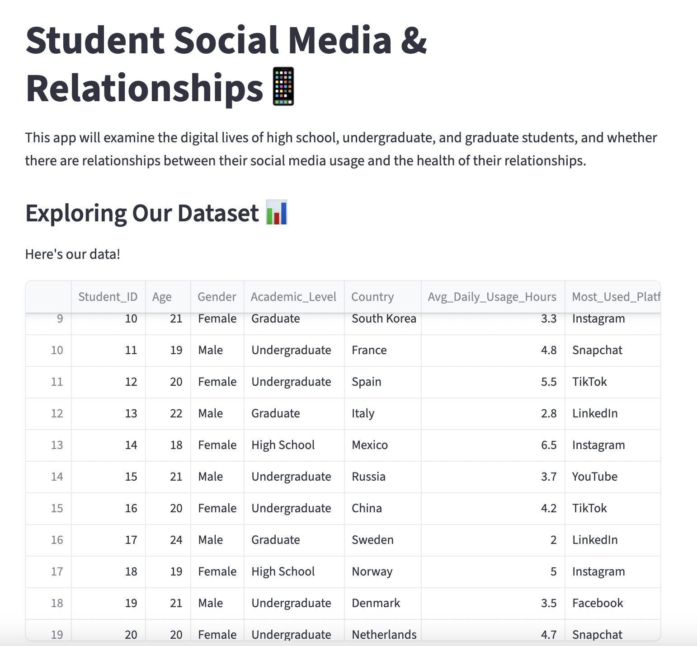
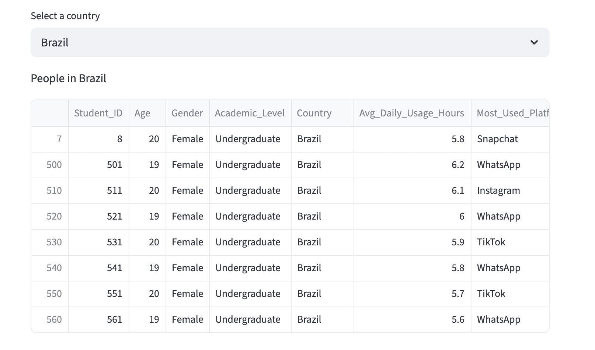
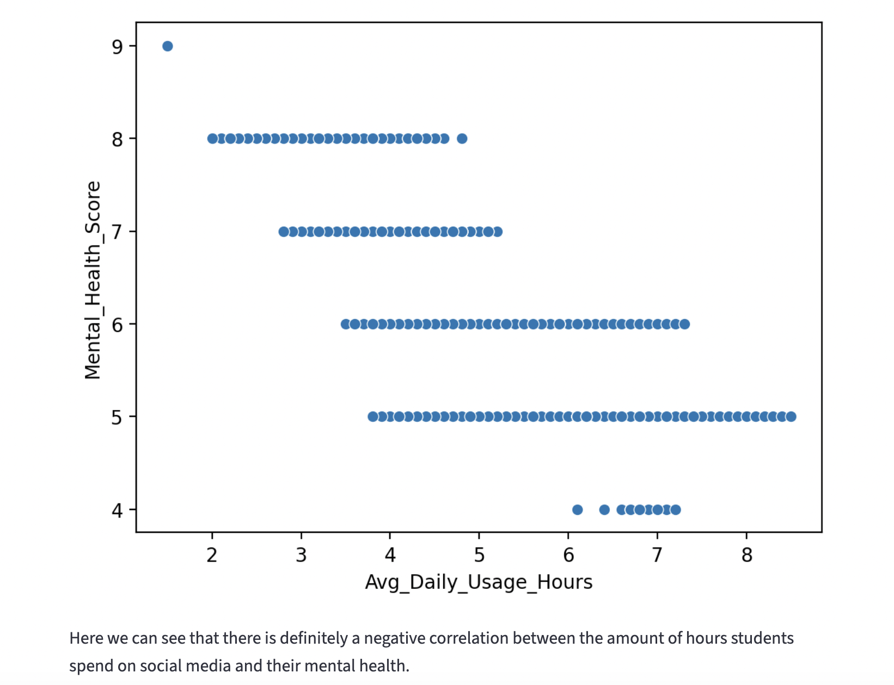
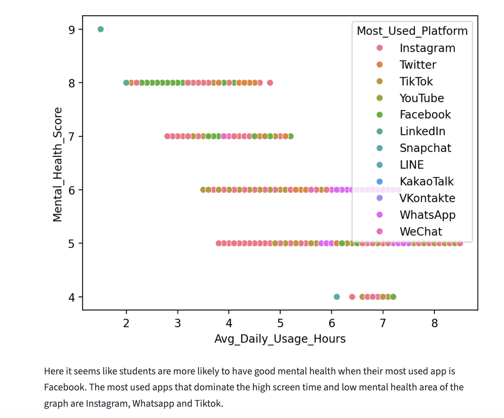
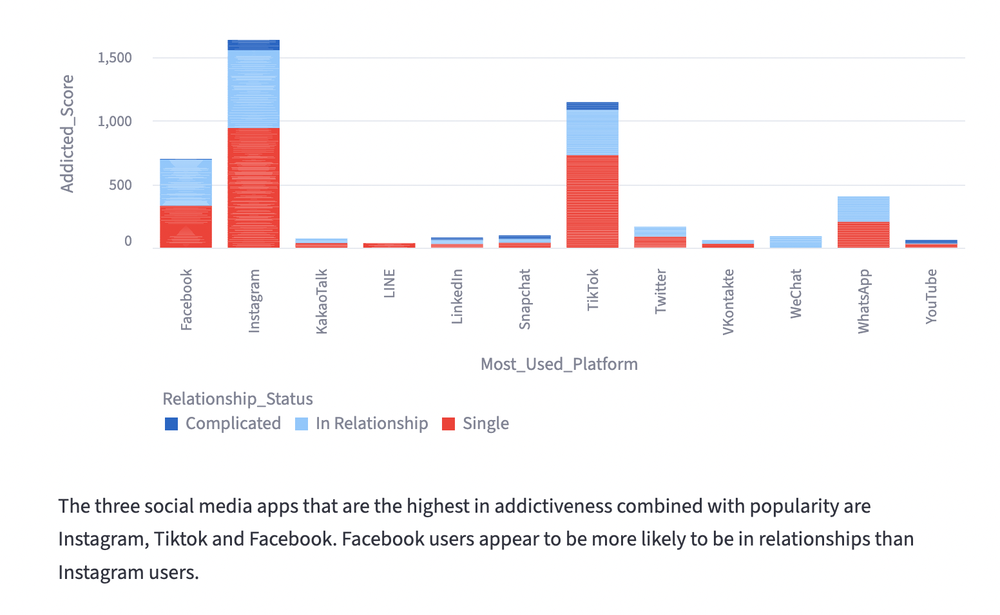
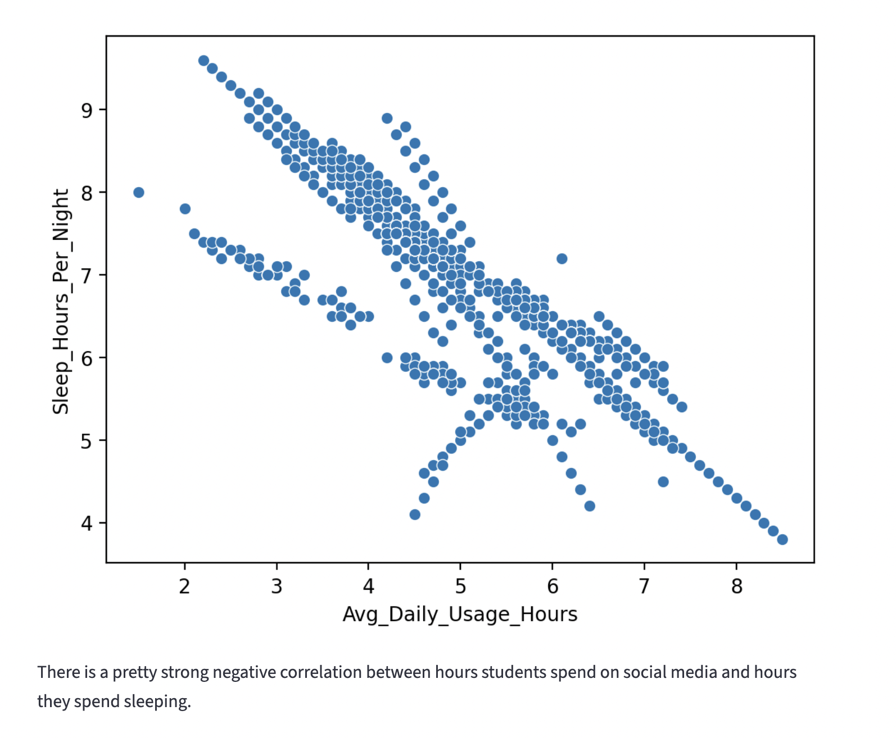
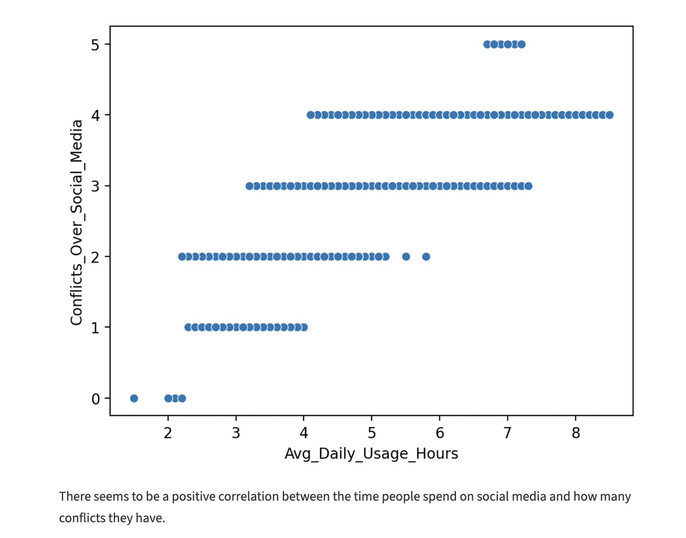

# **Welcome to my first official Streamlit app! 👋**
The goal of this project was to practice using using streamlit to analyze and create visualizations for a dataset. Users can explore the data, as well as view graphs that help answer key questions about student social media usage!

First, users are given the chance to explore the data on their own. They can scroll through and see every single observation, as well as filter the observations by country.

**Question 1 - Does social media usage affect mental health?**

**Question 2 - Does social media's effect on mental health differ based on the platform students use the most?**

**Question 3 - Which platforms have the highest levels of addiction among students? Which relationship statuses are the most likely to be addicted?**

**Question 4 - Does increased social media usage lead to less sleep per night?**

**Question 5 - Are people who use social media very frequently more likely to experience relationship conflicts?**

To run this app locally:
1. Clone the repository:
   git clone https://github.com/annabohlen/Bohlen-Data-Science-Portfolio/basic_streamlit_app.git
   cd basic_streamlit_app
2. Download the necessary libraries and versions:
   streamlit==1.33.0,
pandas==2.2.2,
seaborn==0.13.2,
matplotlib==3.8.4
3. Run the streamlit app
   (streamlit run main.py)
   
Here are some of the resources I used to build this app: 
   It seems that the Kaggle dataset I used has since been deleted by the user who posted it; here is another analysis of the same dataset instead: https://www.kaggle.com/datasets/zahranusratt/student-social-media-addiction-analysis-dataset 
   Streamlit cheat sheet: https://docs.streamlit.io/develop/quick-reference/cheat-sheet 
   Markdown guide: https://www.markdownguide.org/basic-syntax/ 
   Data Visualization guide: https://www.geeksforgeeks.org/data-visualization/data-visualisation-in-python-using-matplotlib-and-seaborn/
